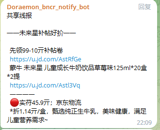

# Bncr_plugin 简介

自用的无界插件。

# 安装与使用

在红灯区同级目录创建一个文件夹，名字随意 如：自用插件，把当前仓库所有文件粘贴到自用插件下

# 注意事项

> 大部分插件均无界超授可用。（具体以插件内部提示为准）

# 主要功能
| 功能名称                   | 描述                                                                              | 是否需要超授 |
|------------------------|---------------------------------------------------------------------------------|------------|
| ~~常规签到爬取.js~~          | ~~扫描某文档当天签到token。~~                                                             | ✅      |
| Doraemon_代理剩余次数.js     | 获取代理剩余数量。                                                                       | ✅      |
| Doraemon_用户消息推送.js     | 通过奶酪棒与用户的绑定关系，进行消息的推送。                                                          | ✅      |
| Doraemon_变量替换.js       | 变量替换，变量同步。                                                                      | ✅      |
| Doraemon_一键操作.js       | 针对无线活动的一些一键操作。                                                                  | ✅      |
| Doraemon_轮换青龙脚本代理.js   | 随机轮换代理。                                                                         | ✅      |
| Doraemon_ck轮换.js       | 针对青龙环境变量做一些处理，随机轮换。                                                             | ✅      |
| Doraemon_青龙定时任务迁移.js   | 从源青龙迁移定时任务到目标青龙。                                                                | ✅      |
| Doraemon_无线店铺签到清理.js   | 无线店铺签到清理替换并执行。                                                                  | ✅      |
| Doraemon_ck检测.js       | ck有效性实时检测并通过奶酪棒绑定关系推送消息给用户。                                                     | ✅      |
| Doraemon_JD_WSCK转换.js  | 调用nolan pro 转换api接口。                                                            | ✅      |
| Doraemon_青龙相关备份.js     | 定时备份青龙配置文件，防止因读写频繁导致配置文件丢失。                                                     | ✅      |
| Doraemon_更换代理白名单.js    | 代理更换白名单，支持品易、巨量、携趣、豆芽等。                                                         | ✅      |
| Doraemon_redis连通性.js   | 测试redis是否链接正常。                                                                  | ✅      |
| Doraemon_续费插件.js       | 用户续费的一些相关功能插件。                                                                  | ✅      |
| Doraemon_ql方法公开说明文档.js | Doraemon_ql api 说明文档                                                            | ❌      |
| Doraemon_端口扫描.js       | 扫描端口是否开放。                                                                       | ✅      |
| Doraemon_h5st服务.js     | h5st服务接口。                                                                       | ✅      |
| Doraemon_检测ck重复.js     | 检测有效ck是否重复。                                                                     | ✅      |
| Doraemon_返利插件.js     | 京东、淘宝、拼多多返利相关插件，可转链，可查询，可监听指定群组，转发解析或者转链发到指定群组                                  | ✅      |
| 青龙通知接口.js              | 通过青龙面板日志推送做一些事情，具体看插件注释。                                                        | ❌      |
| Bncr_spy定时任务功能插件.js    | 与Bncr_spy 定时任务的交互的功能插件。                                                         | ✅      |
| 一键通知.js                | 通过配置目标自定义名称 和 userId，达到针对单个人 或多个人 发送消息的功能。                                      | ✅      |
| 京东口令url互转.js           | 东东口令 url 互相转化                                                                   | ✅      |
| 登录.js                  | 支持 nolanPro (扫码登录、口令登录、Mck短信登录)，rabbitPro（扫码登录、口令登录、Mck短信登录），qrabbit(扫码登录、口令登录) | ❌      |

# 参与

我们欢迎您在 Bncr_plugin 项目的 GitHub 上报告 issue。

# 关于作者

一个啥也不会的混子。

# 友情链接（排名不分先后）

| 名称 | 链接 | 描述                               |
| ---- | ---- |----------------------------------|
| 无界官网 | [https://anmours.github.io/Bncr](https://anmours.github.io/Bncr) | -                                |
| 红灯区插件 | [https://github.com/RedLightsDistrict/Bncr_plugins.git](https://github.com/RedLightsDistrict/Bncr_plugins.git) | -                                |
| onz3vyyds | [https://github.com/Yuheng0101/Bncr_plugins](https://github.com/Yuheng0101/Bncr_plugins) | -                                |
| 薛定谔的大灰机 | [https://github.com/BigPlanes/Bncr_plugins](https://github.com/BigPlanes/Bncr_plugins) | -                                |
| 小熊 | [https://github.com/hsl6476/Bncr_plugins](https://github.com/hsl6476/Bncr_plugins) | -                                |
| Dswang | [https://github.com/callacat/BncrJS_plugins](https://github.com/callacat/BncrJS_plugins) | -                                |
| 给我一颗麦丽素 | [https://github.com/dandanainiyo/bncr_plugins.git](https://github.com/dandanainiyo/bncr_plugins.git) | -                                |
| VICTOR LI | [https://github.com/victorli-cn/Bncr_plugins.git](https://github.com/victorli-cn/Bncr_plugins.git) | -                                |
| DusKing | [https://github.com/DusKing1/Bncr_plugin.git](https://github.com/DusKing1/Bncr_plugin.git) | -                                |
| 烟烟烟烟烟雨啊！！！ | [https://github.com/yanyuwangluo/Bncr_plugins](https://github.com/yanyuwangluo/Bncr_plugins) | -                                |
| 寒寒 | [https://github.com/djun90/hh_bncr_plugins](https://github.com/djun90/hh_bncr_plugins) | 短链解析、美团登录、rabbitPro登录、巨量签到、店铺签到等 |
| Mrzqd | [https://github.com/Mrzqd/Bncr_pulgins](https://github.com/Mrzqd/Bncr_pulgins) | qq频道适配器                          |
| Merrick | [https://github.com/Merrickk/Bncr_plugins/tree/main](https://github.com/Merrickk/Bncr_plugins/tree/main) | 企业微信适配器                          |
| ~~Aeorq~~ | ~~[https://github.com/Aeorq/bncrspy](https://github.com/Aeorq/bncrspy)~~ | Bncr_spy的监控配置                    |

# 部分功能展示

## Doraemon_返利插件.js

